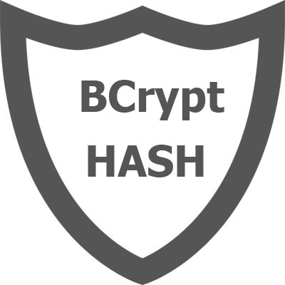

# Backend_MERN

### Sobre el proyecto
Es el sexto proyecto que realizamos en [GeekHubs Academy](https://geekshubsacademy.com/), consiste en la realización de un Backend para una red social, utilizando MongoDB, Mongoose, Express y NodeJS.

## Pre-requisitos 📋

Necesitaremos la instalación de un programa para realizar nuestro código, en este proyecto se ha utilizado [Visual studio code](https://code.visualstudio.com/Download/),

### Tecnologías utilizadas 🚀

El proyecto ha sido desarrollado utilizando los siguientes paquetes en Nodejs y herramientas:

 

 

 

## ¿Como desplegar el proyecto? 📋
Estas instrucciones te permitirán obtener una copia del proyecto en funcionamiento en tu máquina local para propósitos de desarrollo:

Clonarte el repositorio localmente:

> git clone url del repositorio
  
Instalar las depedencias necesarias:
  
> npm i
  
Rellenar las variables necesarias en estos archivos para iniciar el proyecto:
  
> config.example.json -> Incluir campos nodemailerUser, nodemailerPass, AUTH_SECRET, AUTH_EXPIRES y AUTH_ROUNDS
  
😊 Genial ya tenemos todo listo para poder llamar a los endpoints, ya podemos recibir y modificar datos 😊

## Endpoints 🛠️

El sistema puede realizar las siguientes acciones:

- CRUD Posts
- CRUD Comments
- CRUD Users
- Encriptación de ciertos campos mediante Bcryptjs
- Proceso de autenticación mediante jsonwebtoken
- El sistema permite administrar a los usuarios por roles
- Registro mediante email de confirmación
- Login al realizar confirmación de email

Para ver mas detalladamente el funcionamiento de cada endpoints consultar el siguiente enlace:

## Autores ✒️

* **Cristian Santamaria**
* **Raquel Moya**
* **Aída Ródenas**